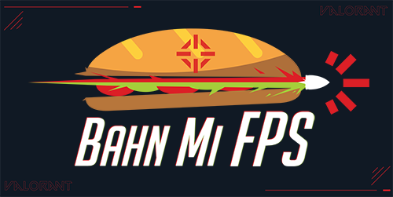

<!-- PROJECT LOGO -->
 

  

  <h3 align="center">Pokemon Memory Game</h3>

  

    Pokemon API is actually nuts
     
     
     
    <a href="https://bahnmifps-pokemon.netlify.app/">View Demo</a>
    ·
    <a href="https://github.com/BahnMiFPS/pokemon-memory-game/issues">Report Bug</a>
    ·
    <a href="https://github.com/BahnMiFPS/pokemon-memory-game/issues">Request Feature</a>
  

<!-- ABOUT THE PROJECT -->

## About The Project

[![Product Name Screen Shot][product-screenshot]](https://bahnmifps-pokemon.netlify.app/)

Pokemon API is actually nuts

(<a href="#readme-top">back to top</a>)

<!-- ROADMAP -->

## Roadmap

- [ ] ... ... ...

(<a href="#readme-top">back to top</a>)

<!-- CONTACT -->

## Contact

BahnMiFPS

Project Link: [https://github.com/BahnMiFPS/pokemon-memory-game](https://github.com/BahnMiFPS/pokemon-memory-game)

(<a href="#readme-top">back to top</a>)

<!-- MARKDOWN LINKS & IMAGES -->

[product-screenshot]: images/screenshot.png
